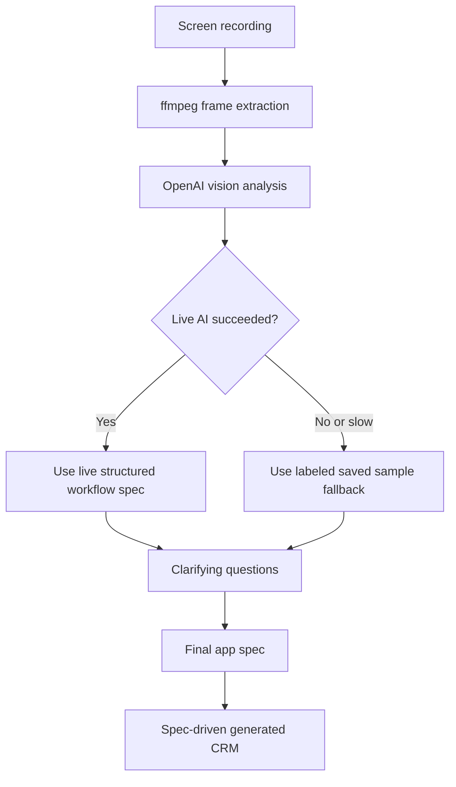

# WorkTape User Flow Diagram

## Core User Flow

```mermaid
flowchart LR
  A["User opens WorkTape"] --> B["Upload or select screen recording"]
  B --> C["Backend extracts key frames with ffmpeg"]
  C --> D["Vision model analyzes frames"]
  D --> E["Structured workflow JSON"]
  E --> F["Show extracted steps, objects, fields, statuses"]
  F --> G["Ask 3-5 clarifying questions"]
  G --> H["Create final app spec JSON"]
  H --> I["Show spec-to-app mapping"]
  I --> J["Open generated internal tool"]
  J --> K["Use live CRM: form, table, statuses, templates, CSV"]
```

## Wednesday Demo Path

1. Open WorkTape.
2. Use a workflow recording or the saved sample path.
3. Show analysis/extraction.
4. Review detected workflow steps and objects.
5. Answer clarifying questions.
6. Create the final spec.
7. Show how the spec maps to app screens.
8. Open the generated admissions tool.
9. Add/update records, copy WhatsApp templates, and export CSV.

## Real vs Fallback Path

## Key Product Principle

The user never starts from a blank prompt. The recording is the spec.
